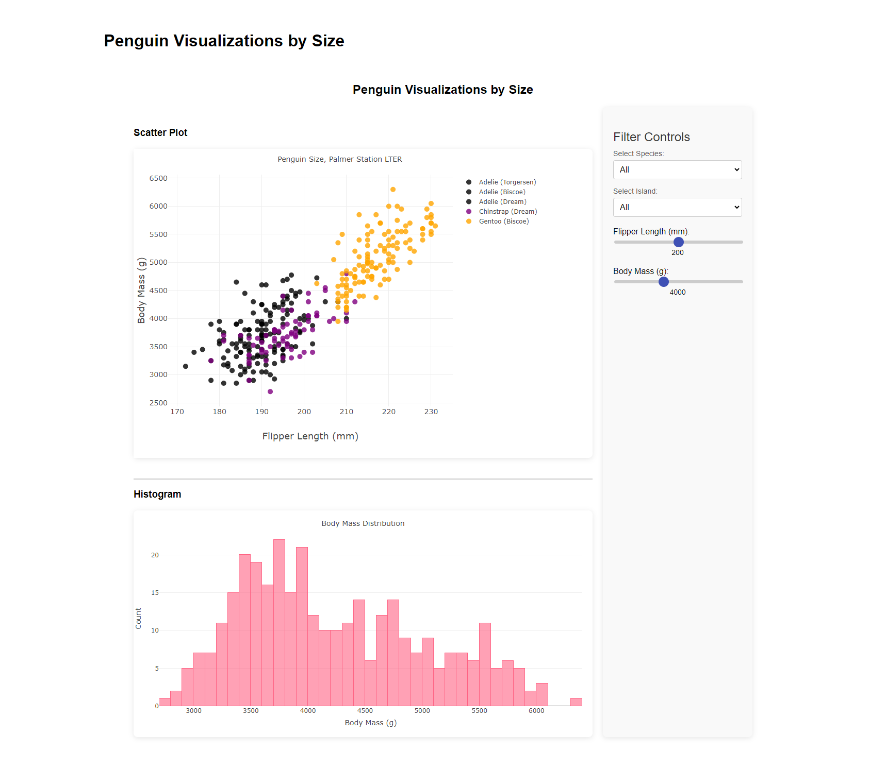

# Penguin Dashboard

### Approach

This project was developed to provide an interactive dashboard for visualizing data, in this case, it's been used one penguin dataset, but you can easily substitute it for any other scenario. I chose Vue.js for the front end because of its ease of use and flexibility in building dynamic user interfaces. Flask was selected for the backend due to its lightweight nature and ability to serve APIs efficiently. We are also using Plotly on the front and back end.

The communication between the frontend and backend is facilitated using Axios for making HTTP requests, enabling real-time data filtering based on user inputs. 

### Assumptions

- Users have a basic understanding of command line operations.
- Have the following installed on machine: Python 3.x, Pipenv, Node.js
- The dataset (penguins.csv) is correctly formatted and located in the `server` directory as expected by the backend.


## Overview

The Penguin Dashboard is a web application designed to visualize and analyze data on penguins. This project utilizes Vue.js for the front end and Flask as the back end to serve data and handle user interactions. Users can filter penguin data through sliders and dropdowns, dynamically updating scatter plots and histograms based on their selections. Other options exist to interact with the plot by clicking or selecting an area on them.



## Features

- Interactive scatter plots and histograms.
- Filtering options based on species, island, flipper length, and body mass.
- Responsive design for a seamless user experience.

## Technologies Used

- **Frontend**: Vue.js, Plotly.js, TypeScript, Vite, Axios
- **Backend**: Flask, Pandas, plotly, CORS
- **Package Management**: Pipenv, NPM

### Setup Instructions

1. **Clone the repository:**

   ```bash
   git clone https://github.com/pebueno/penguin-dashboard.git
   cd penguin-dashboard
   ```

2. **Set up the Backend:**

   Navigate to the server directory:

   ```bash
   cd server
    ```
   Install dependencies using Pipenv:
   ```bash
   pipenv install
    ```
   Run the Flask server:
   ```bash
    pipenv shell
    flask run
    ```
    *Your backend will run on localhost:5000/api/data*

3. **Set up the Frontend:**

   Navigate to the client directory: *(You should do it in another shell and run both concurrently)*

   ```bash
   cd client
   ```

    Install dependencies using npm:
    ```bash
    npm install
    ```

    Run the Vue.js application:
    ```bash
    npm run dev
    ```